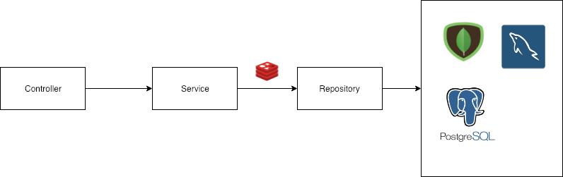
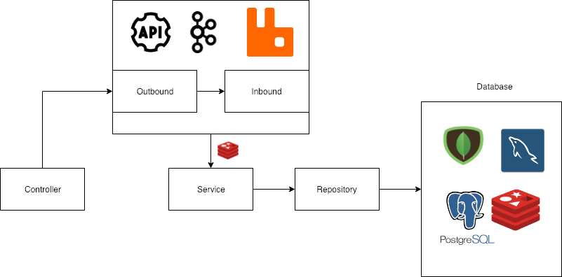
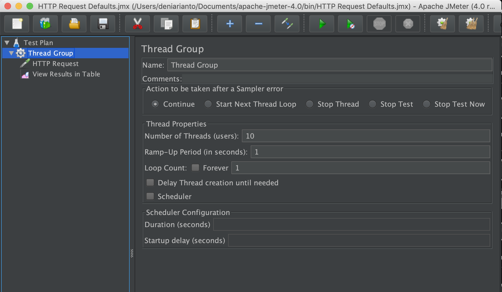
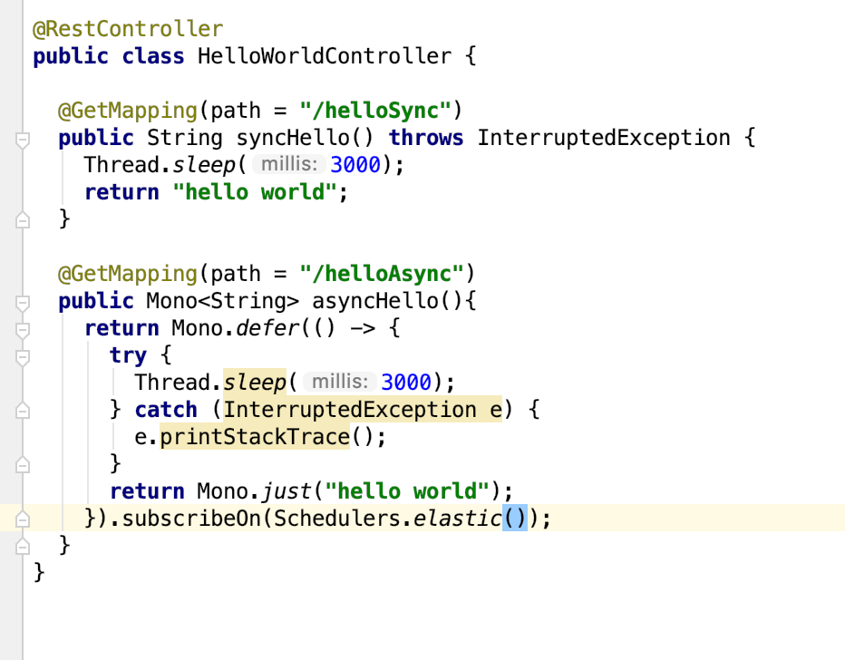
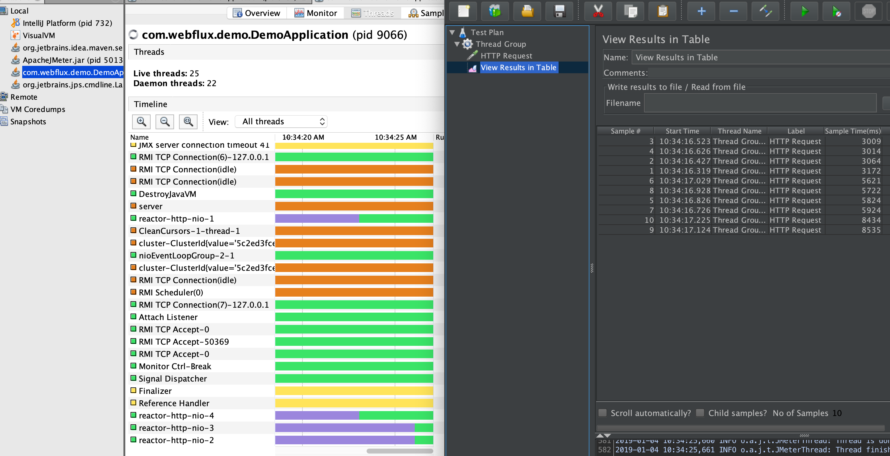
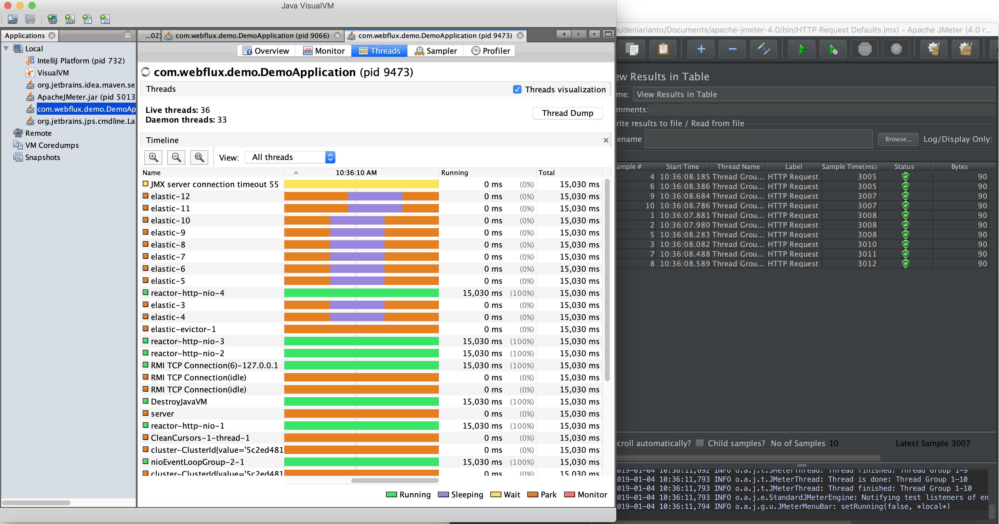

1. Common process (CRUD)

   

   In a normal process like CRUD, the steps generally follow a common flow that starts from Controller -> Service -> Repository -> Database. However, in Spring Webflux, all processes are asynchronous.

   In the CRUD process, there are several methods that are commonly used, such as:

   - map
   - flatMap
   - defer

2. Messaging Process (Kafka, RabbitMQ, Other Service API)

   

   Meanwhile, for the messaging process (usually using a process queue), we have the Outbound and Inbound layers, where:

   - Outbound: Serves as the layer used to publish topics (producer). This layer is responsible for creating topics (queues) for internal services or external API services.
   - Inbound: Serves as the layer used to receive topics (consumer). In this layer, data is received and processed to be used according to the respective features.

3. What is the difference between using Spring MVC and Spring Webflux?

   The most noticeable and visible difference when using Spring Webflux, based on experience with this framework, is evident when looking directly at the threads.

   Here are the test results comparing requests processed using synchronous and asynchronous processes, hit by 10 simultaneous requests.

   The configuration settings and code used are as follows:

   

   
and the code used is as follows: 

   

   > In the default state, the synchronous process has software threads corresponding to the CPU cores. This test uses an i3 CPU with 4 cores, resulting in 4 software threads.

   Sync proses :

   

  As seen in the image, the default synchronous process will use the default software threads named reactor-http-nio (with 4 threads: -1, -2, -3, -4), and the sample times range from 3 to 5.5 to 8.5 seconds, consistent with the code being set to sleep      for 3 seconds.

   Async proses : 

   

   Meanwhile, for the asynchronous process, it can be seen that Webflux creates threads separate from the software threads, named elastic-3 to elastic-12 (10 threads) corresponding to the 10 requests made. This allows the 10 requests to be completed        simultaneously, around 3 seconds (matching the thread sleep duration).

5. Spring Reactor
   Spring Reactor is a reactive programming library that provides a foundation for building asynchronous, non-blocking applications on the JVM. It is part of the Spring Webflux ecosystem and enables handling of high-throughput, scalable operations with       minimal resource consumption. Reactor leverages Project Reactor, which provides two core reactive types:

   - Mono: Represents a single value or no value (0..1).
   - Flux: Represents a stream of multiple values (0..N).
  ** Why Use Spring Reactor?**
      - Asynchronous and Non-blocking: Handles multiple concurrent operations without blocking threads.
      - Backpressure Handling: Efficiently manages data flow using the Publisher-Subscriber model.
      - High Performance: Ideal for I/O-intensive applications like microservices and APIs.
      - Integration: Works seamlessly with Spring Webflux, R2DBC, and other reactive frameworks.
   
   **Key Concepts**
   Mono and Flux:

   Mono.just("Hello"): Emits a single value.
   Flux.range(1, 5): Emits a range of integers from 1 to 5.
   Operators:

   Transform data: .map(), .flatMap()
   Filter: .filter()
   Combine: .zip(), .merge()
   Schedulers:

   Control thread execution with Schedulers.parallel(), Schedulers.elastic(), etc.

4. How to run
   - Install mongodb, java 8, maven
   - Create database on mongo db : webflux-demo
   - run mvn clean install
   - Run application
