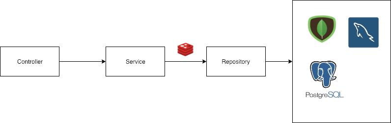
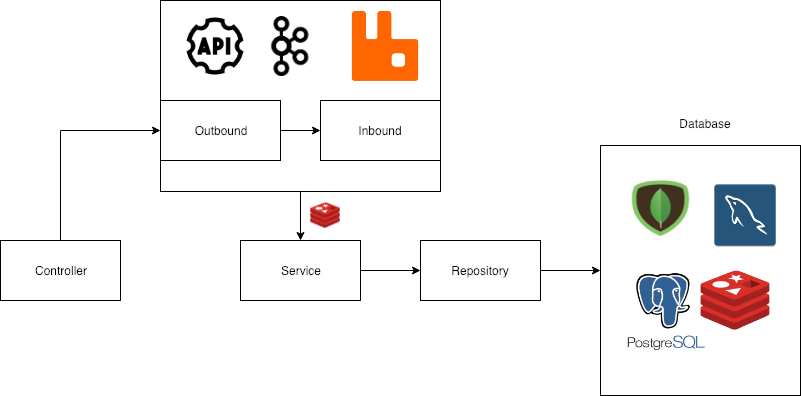
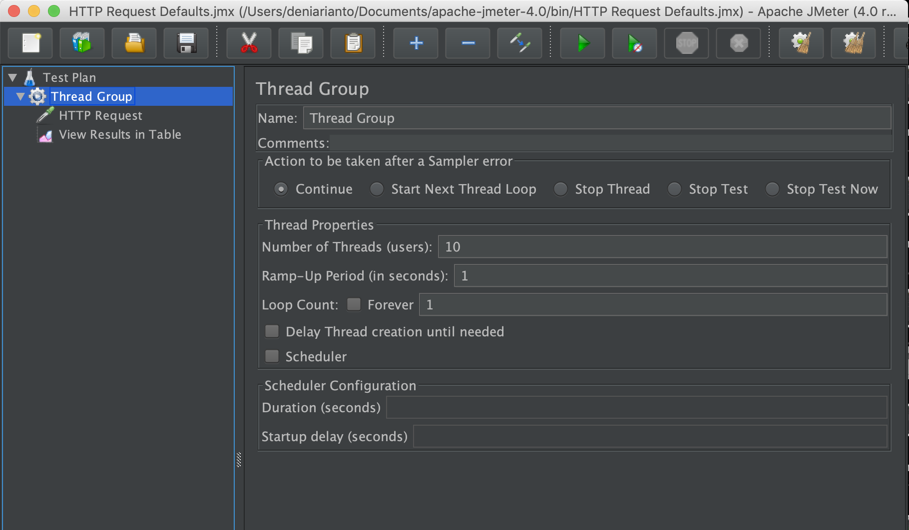
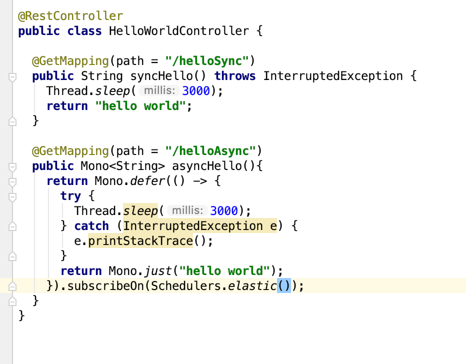
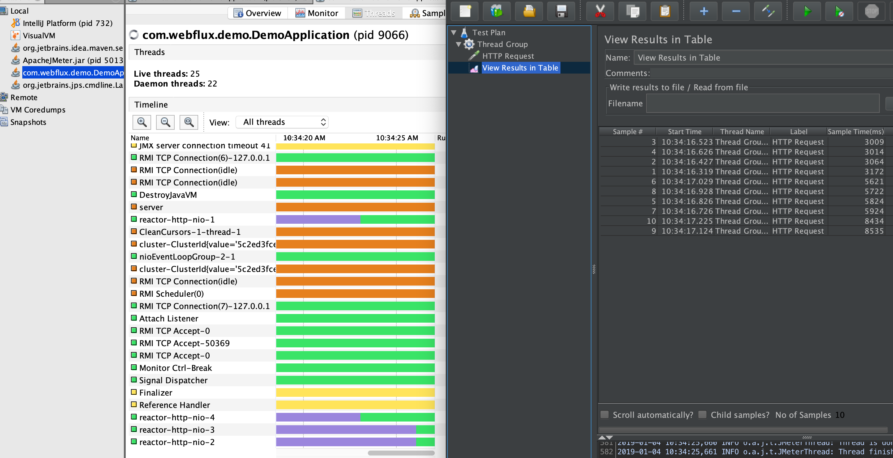
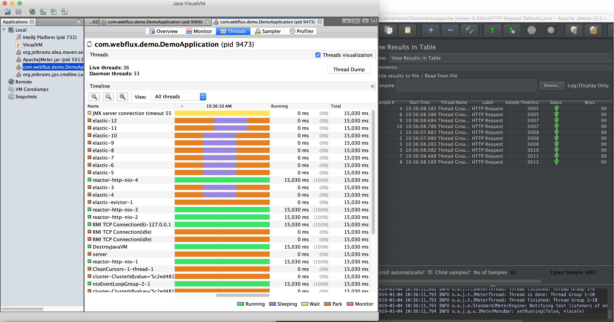

1. Common process (CRUD)

   

   Dalam proses yang normal seperti CRUD, proses yang dilakukan adalah proses yang umum yang dimulai dari Controller -> Service -> Repository -> Database. Hanya saja dalam Spring Webflux, semua proses yang digunakan adalah proses asyncrounous.

   Dalam proses CRUD, ada beberapa method yang sering digunakan seperti :

   - map
   - flatMap
   - defer

2. Messaging Process (Kafka, RabbitMQ, Other Service API)

   

   Sedangkan untuk messaging process (biasanya mengunakan process queue), kita memiliki layer Outbound dan Inbound, dimana :

   - Outbound : Sebagai layer yang digunakan untuk melempar topic (producer). Dimana layer ini data digunakan untuk membuat topic (queue) terhadap service internal maupun service API external.
   - Inbound : Sebagai layer yang digunakan untuk menerima topic (consumer). Dimana layer ini data diterima dan diolah untuk kemudian digunakan sesuai masing-masing fitur.

3. Apa sih perbedaan menggunakan Spring MVC dan Spring Webflux

   Perbedaan yang paling terasa dan terlihat mata saat menggunakan Spring Webflux selama pengalaman menggunakan framework ini adalah jika kita melihat langsung ke dalam thread.

   Berikut adalah hasil test antara request yang dihit menggunakan sync dan async proses, dan di hit oleh 10 request yang bersamaan.

   Config pengaturan dan code yang digunakan seperti ini : 

   

   dan code yang digunakan seperti ini : 

   

   > pada keadaan default sync proses memiliki thread software sesuai dengan core CPU, test ini menggunakan CPU i3 dengan 4 core, sehingga akan memiliki 4 thread software.

   Sync proses :

   

   Terlihat di gambar, bahwa secara default sync prosess akan menggunakan default thread software dengan nama reactor-http-nio (dengan jumlah 4 thread -1, -2, -3, -4) dan sample time berkisar 3 ke 5,5 dan ke 8,5, sesuai dengan code yang di sleep selama 3 detik

   Async proses : 

   

   Sedangkan untuk async proses, terlihat webflux membuat thread yang terpisah dari thread software dengan nama elastic 3 - 12 ( 10 thread ) sesuai dengan 10 request yang di hit, sehingga 10 request tersebut dapat selesai dengan waktu yang bersamaan, dikisaran 3 detik (sesuai thread sleep)

4. How to run
   - Install mongodb, java 8, maven
   - Buat database dimongodb dengan nama : webflux-demo
   - Jalankan perintah mvn clean install
   - Run aplikasi menggunakan command line ataupun melalui tombol run yang ada di IDE